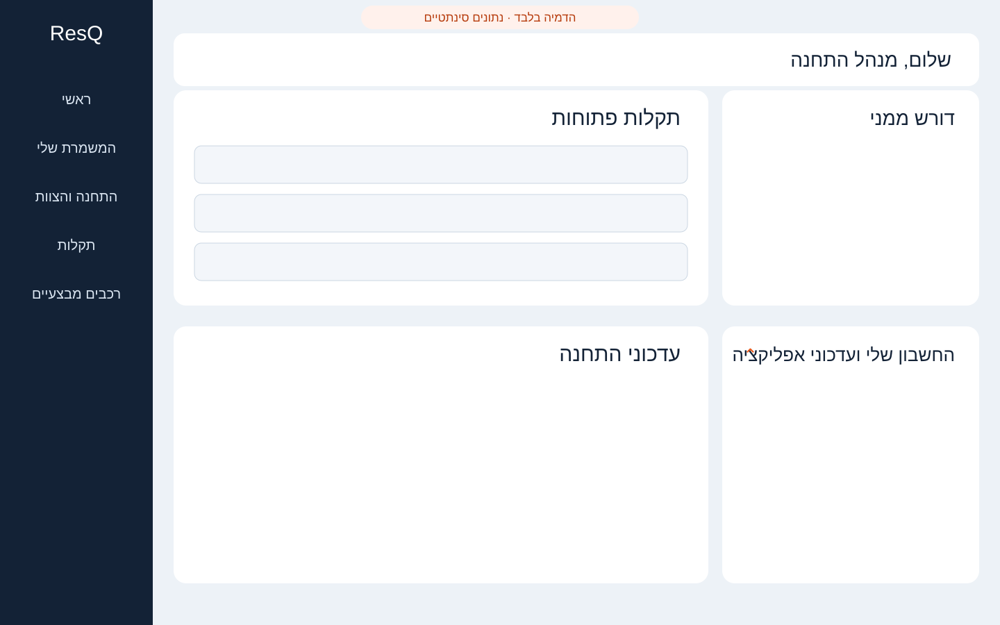
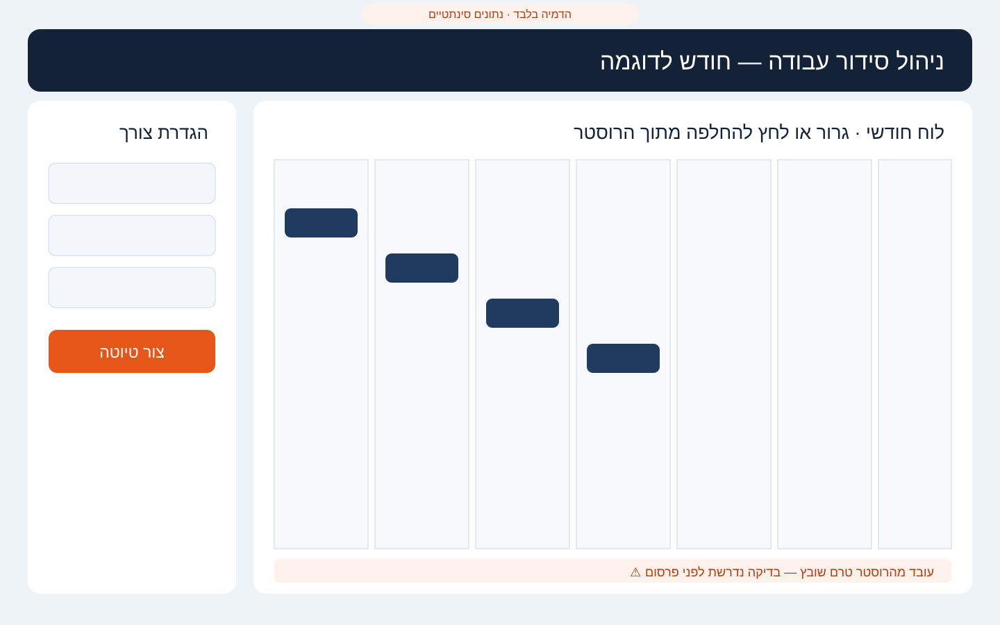
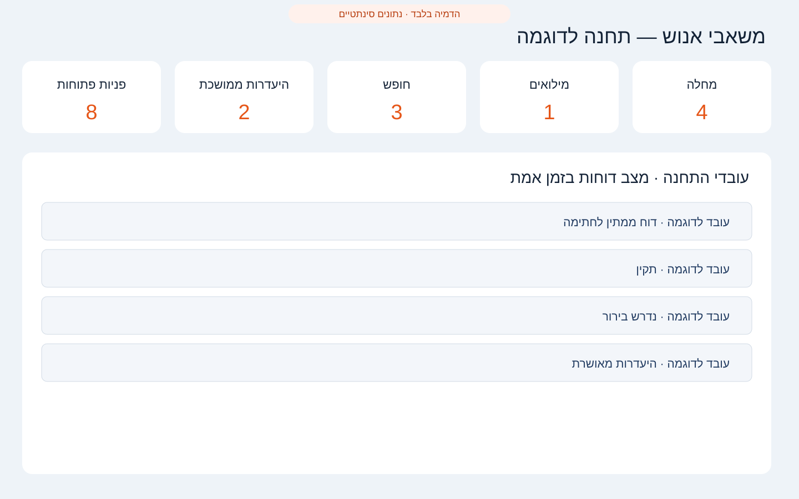
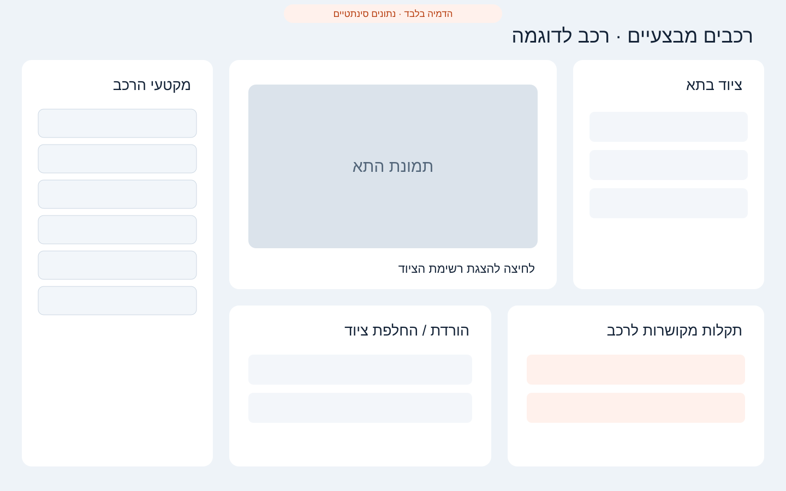

# ResQ — Design proposals (approval required)

Status: **proposal only**. None of the layouts below is implemented in the product.

## 1. Desktop command center

- Full-height navigation rail on the left.
- Main operational content uses the available desktop width.
- Personal account and application updates are open by default on the right and can be collapsed.
- Mobile layout remains unchanged.

Decision required: approve, reject, or request changes before implementation.
## 2. Schedule manager workspace

- Dedicated workspace under "התחנה והצוות" for authorized officers and schedule managers.
- Monthly view, roster-based assignment, missing-person warnings, and one-click draft generation.
- The signed workforce source is the only basis for "not scheduled" warnings.

Decision required: approve, reject, or request changes before implementation.

## 3. HR live status workspace

- Station-scoped employee roster; never a single 3,000-person screen.
- Live counters for sickness, reserve duty, leave, prolonged absence, and open HR requests.
- Rejected/cancelled items remain in history but are not counted.

Decision required: approve, reject, or request changes before implementation.

## 4. Operational vehicles workspace

- Vehicle selector, compartment photo, inventory list, equipment removal/replacement log, and vehicle-specific faults.
- Sections are collapsible and load only when selected; the mockup intentionally shows several expanded panels so their contents can be reviewed.
- Vehicle rotation uses available real photos now and can accept future 360-degree capture sets.

Decision required: approve, reject, or request changes before implementation.
